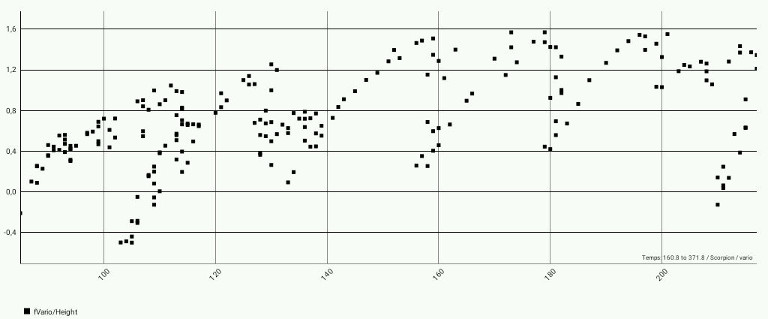

# Charting module

This module is used to plot the data from the processed CSV files.

### General disposition

It is possible to plot any number of columns as Y versus an X column.
The graph is auto scaling.  
For the Y, two simultaneous scales are
possible: one is displayed on the left of the plot and the
other on the right.  
Each curve is attributed a color from the
list: black, blue, cyan, magenta, green, yellow and red.
The color of curves related to the left scale is attributed starting
with black and starting with red for the curves related to the
right scale.  

### Axis attribution

Columns are referenced by their heading. The columns that are
used are initially selected by the preferences stored from a
precedent usage.  
If there is no valid preference, the X axis is
the first column and a single Y axis is the second column.

### Graph interaction

The graph is controlled by the buttons at the bottom of the screen.  
Middle button: let you select the column for the X values.  
The button at the extreme left let you select one or several
columns to plot, sharing the left scale.  
And the extreme right button has the similar function for the right axis.  
The button at the right of the middle button is used to quit this
module and return to the previous screen.  
The button at the left of the middle button (Save as picture) records
the current graph as a picture in the Gallery of your device for
sharing or archive. This image is saved in a sub directory Msb2Kml.
The name is composed from the base of the name of the log file (MSB\_XXXX)
and numbers that are the indexes of the used columns.

It is possible to zoom and pan using the fingers.

### Graph modes

#### Line graph

If the values on the X axis are ordered (time, traveled distance, ...),
the graph is drawn as a line for each Y column.

#### Scatter graph

The graph is composed of isolated dots if the X axis is not composed
of ordered values.  
This graph is composed by default of all values of the appropriate
columns of the file.  
However, if a line graph has been used previously and a zoom has been
performed along the X axis, only the values corresponding to the
visible part are plotted on the subsequent scatter graph.

#### Example

Height, vario and smoothed vario from launch to landing for a flight.

Height and smoothed vario zoomed on a thermal.

Smoothed vario versus height in the thermal.

Conclusion: higher is better for the vario.

### Acknowledgment

This module uses the [MPAndroidChart library](https://github.com/PhilJay/MPAndroidChart).

