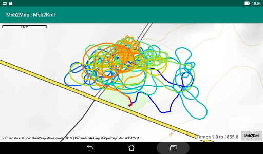

# GPX track on map module

This module draws the track from the GPX file on a map.  
It works with interaction with the
[Msb2Map](https://github.com/msb2kml/Msb2Map) application.

See the [menu](Gallery/MenuVtrk.jpg).
  
## Color

The color of each segment of the track could be modulated by the
corresponding value of one of the columns in the CSV file.  
The color could vary from blue, through green, to red in 12 steps.
The values for each end of the range could be specified.  
Default values are taken from what is recorded in the meta file.

If no column is selected, a segment is red if the altitude (from the
GPX file) is rising and blue if sinking.

A segment is black if there is no valid value for the selected
column in the CVS file.

## Mode "Entire"

The whole track, from the beginning to the end, is drawn on
the map by the Msb2Map application.

The information field in the bottom of the map displays the minimum and
maximum values for the column that has been used to colorize the track.  
If no column has been selected, the minimum and maximum altitudes
are displayed.

A small black dot marker is displayed at the start location of the flight.

### Mode "Vapor trail"

See the explanations for the Msb2Map application.

The track is drawn progressively, location by location, on the map.
It is performed approximately at the real speed or accelerated
X2 or X10.

It is possible to skip some time from the current position on
the track: 2 minutes or 10 minutes.

The drawing could be interrupted while the map is displayed,
to modify the color setup or the speed, to skip some part and then
to continue from the point of suspension.

If the "**Orienting**" field has been checked on the main menu,
the map is rotated to keep heading of the track to the top
of the screen.

Using the "Entire" mode reset the position at the beginning of the track.

The information field displays the current value for the column
that is used to modulate the color or the altitude from the GPX file.

## Reference GPX

It is possible to display the content of another GPX file
before drawing the main GPX.  
This reference GPX could contain locations as turn points (virtual pylons),
another flight for comparison,
routes  that should have been followed (landing axis, triangle, ...)
or border of a security zone.  
Routes and tracks are displayed with a uniform half transparent
magenta color. Locations are displayed as half-magenta diabolos.

## Screen rotation

This module and the Msb2Map application are not reacting to a change
of orientation of the screen.  
However, it is possible to rotate the map with an action of the finger
(unless the auto orientation has been selected for the Vapor trail mode).

