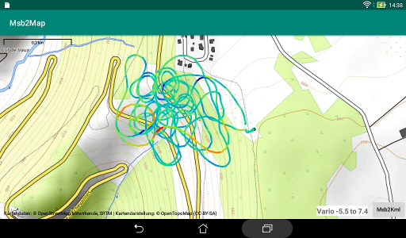

# Installation

The application should be compiled from the sources of this
repository or downloaded from the
["Releases"](https://github.com/msb2kml/Msb2Kml/releases) pages.  
The application package (such as Msb2KmlXX.apk) should be transferred 
to the storage of the device (such as Downloads).  
Selecting it with a File Manager should offer the opportunity to install it.

## Accessory installations

Other applications should be installed for a better experience;
they are all frees.

To look at GPS track in GPX files and display them on an
overlay of topographic maps:
[Msb2Map](https://github.com/msb2kml/Msb2Map/) from the same author.
Minimum version of Msb2Map: 1.70.

To look at GPS track in KML files: [Google Earth](https://play.google.com/store/apps/details?id=com.google.earth).

See: [Screenshot](Gallery/Screenshot_2017-11-22-15-49-49.jpg)

To edit the configuration file: [DroidEdit](https://play.google.com/store/apps/details?id=com.aor.droidedit).

