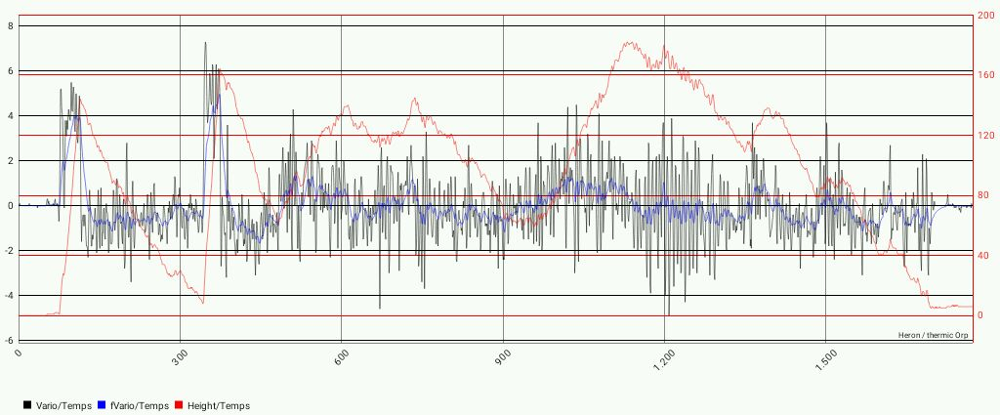
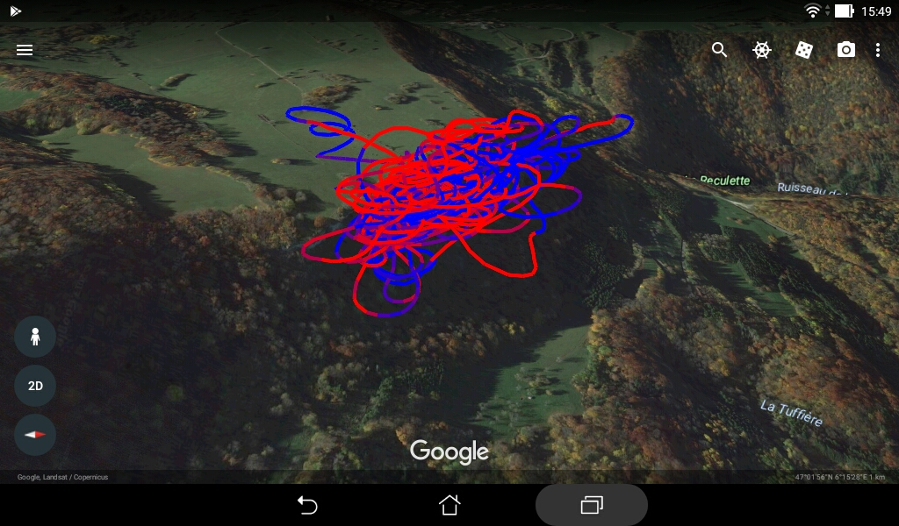

# Purpose
This Android application process and transform the data recorded
by the Multiplex [Flight Recorder](https://www.multiplex-rc.de/produkte/85420-flightrecorder).
This module records on a micro SD card the data circulating
on the MSB telemetry bus.

The data is recorded in CSV files (comma separated values), one line
by sampling time, sensor values in columns separated by semi-colons (;).
Such a file could be used with a spreadsheet program.
But if a GPS sensor is placed on the MSB bus, the position data is
inserted as lines with another format that is not sent by
the return link.
This application makes a separation between these two kinds of data.

However, the Flight Recorder could be used on the ground, connected
to the COM port of a 
[Souffleur](https://www.multiplex-rc.de/produkte/45185-souffleur-deutsch)
or of an HF module for a transmitter. The log files could contain the
data transmitted through the telemetry from the GPS module, including the
position of the plane relative to the pilot.
The Msb2Kml application is able to reconstruct the geographic coordinates of
the flight track from this data if the location of the pilot is provided.
Log files produced by the sibling application Msb2And could also
be processed this way.

Running on a tablet or smartphone, it produces files that could
be viewed and analyzed with the included software modules
and/or with applications available on theses devices.
It could be used to browse the previously processed logs and launch
the applications needed to analyze them.
It acts as a bridge between the MSB format and the KML
format used by Google Earth: thus the name "MSB to KML".

This is a standard Android/Java application that request only the permission
to read and write files. You could have to check in the settings
of the device that the installation of applications from other
sources than Google Play is permitted.

It should work on Android versions from Jelly Bean (4.1) to Oreo (8.0).

# Installation
The application could be compiled with AndroidStudio from the files
downloaded from this repository.

Alternatively it could be obtained with the documentation from
the "Releases" pages from the repository.

In each case the application package (such as Msb2Kml52.apk) should be
transferred to the storage of the device (such as Downloads).
Selecting it with a File Manager should offer the opportunity
to install it.

Other applications should be installed for a better experience;
all of them are free.

To look at GPS track in GPX files:
[GPS Track Browser and Viewer](https://play.google.com/store/apps/details?id=com.qbedded.TrackBrowser) from Google Play.

To look a GPS track in GPX files and display them on off-line
map overlays: [OsmAnd](https://play.google.com/store/apps/details?id=net.osmand)
from Google Play or [OsmAnd](https://f-droid.org/repository/browse/?fdfilter=osmand&fdid=net.osmand.plus) from F-droid.

To look at GPS track in KML files: [Google Earth](https://play.google.com/store/apps/details?id=com.google.earth).

To edit the configuration file: [DroidEdit](https://play.google.com/store/apps/details?id=com.aor.droidedit) from Google Play.

# Screenshots

Vario, smoothed vario and height:

Slopesoaring:

